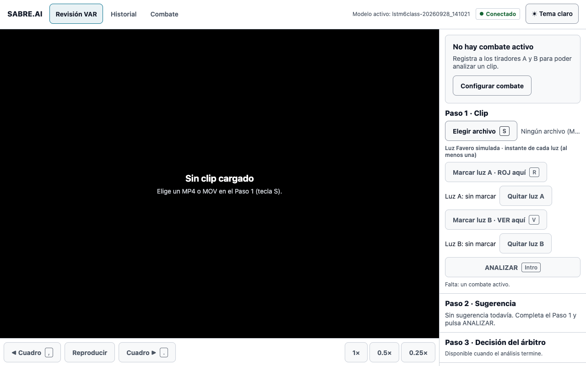
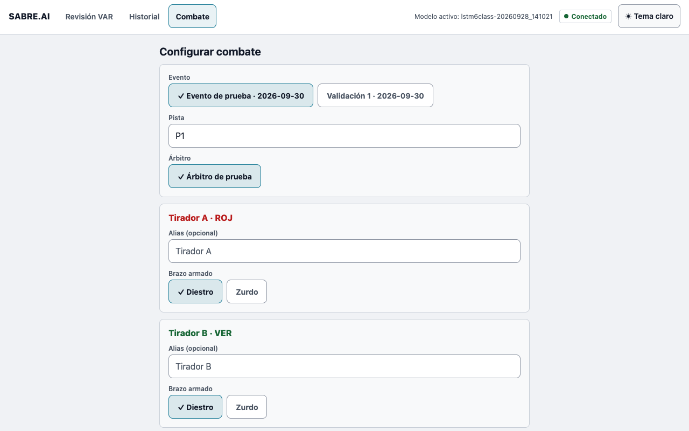
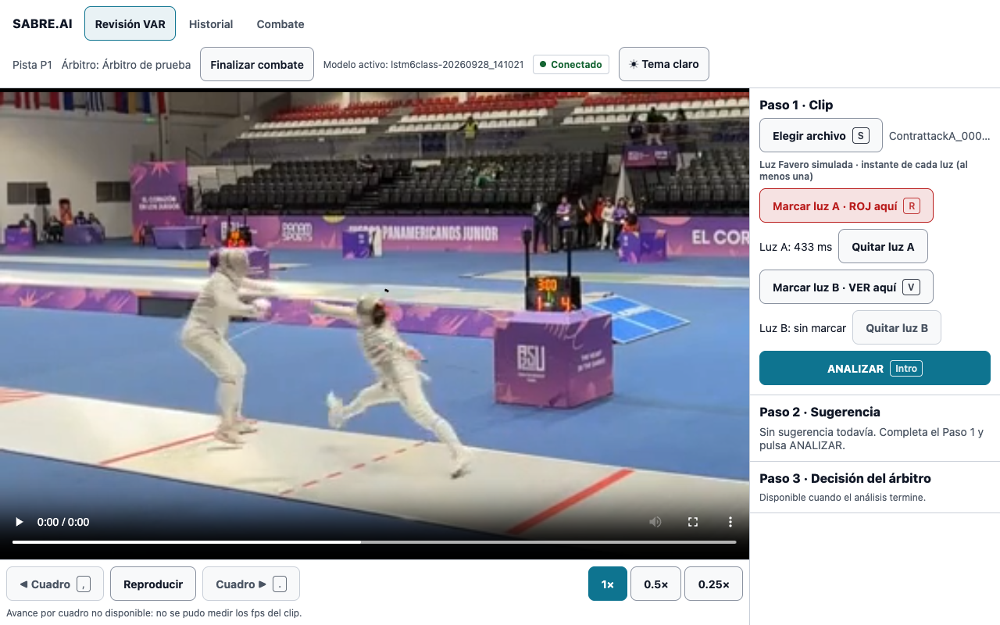
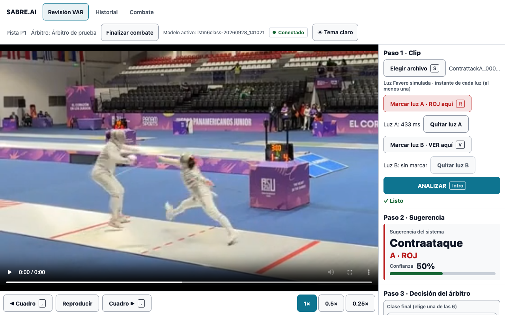
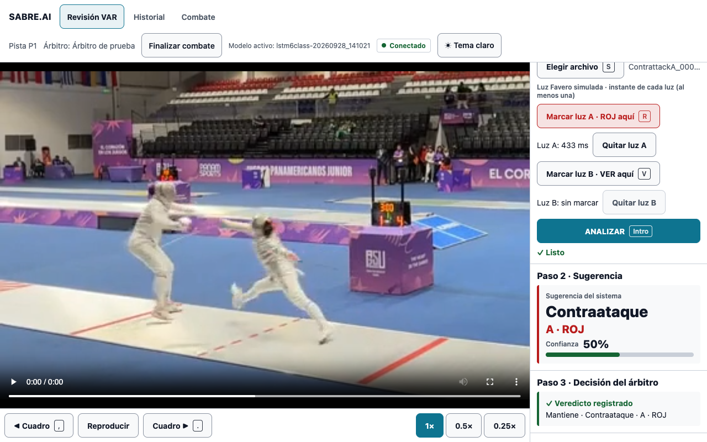
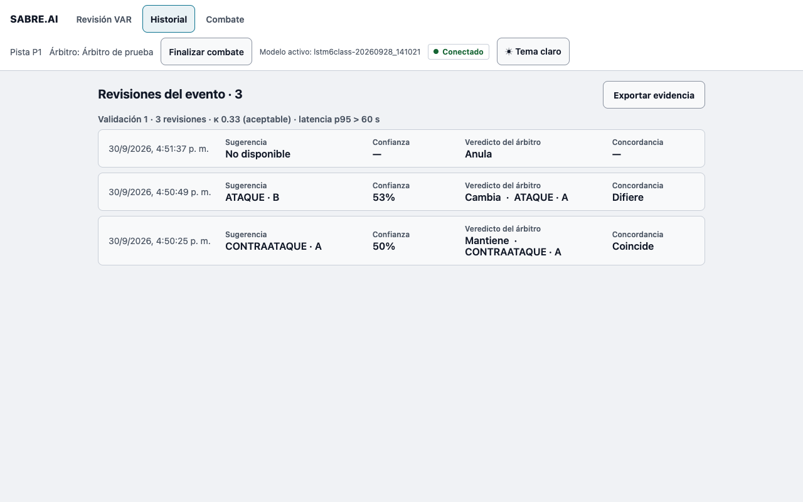

# Instrucciones para el árbitro: prueba de SABRE.AI

SABRE.AI **sugiere** una clasificación de la acción; **usted decide**. Nada se cierra sin su veredicto.

**Enlace:** `<URL de la prueba>` (use Google Chrome en computador) · **Usuario:** `<usuario>` · **Contraseña:** se la enviamos por separado. Disponible de `<inicio>` a `<fin>`.

## Pasos

1. Abra el enlace e ingrese usuario y contraseña. 
2. Pulse **Configurar combate**. Elija el evento **"Prueba remota árbitro"**, su nombre como árbitro, y los tiradores con su brazo armado. 
3. Pulse **Elegir archivo** (tecla S) y seleccione uno de los clips recibidos por correo.
4. Reproduzca el clip y marque la luz: tecla **R** para el tirador A (rojo) y tecla **V** para el tirador B (verde), en el instante en que se enciende. 
5. Pulse **ANALIZAR** (tecla Intro) y espere la sugerencia. 
6. Responda **¿Modifica la clase sugerida?**: **No** la mantiene; **Sí** le deja elegir otra de las 6 clases. También puede **Anular la acción**. Revise el resumen y pulse **Confirmar y registrar**. 
7. Repita con el siguiente clip. En **Historial** verá sus revisiones. 

Si algo no carga, recargue la página. Si un clip es demasiado grande, la pantalla lo avisará.

## Al terminar

Complete el formulario cualitativo: `<enlace al formulario>`. Gracias por su tiempo.
