# Manual de usuario de SABRE.AI

Versión de la interfaz: Validación 1 (carga de clip y tocado simulado). Destinatarios: el árbitro y el operador que usan la interfaz durante una sesión. La instalación del sistema está en `GUIA_INSTALACION.md`.

## 1. Propósito y alcance

SABRE.AI clasifica la acción táctica de un tocado de sable en 6 clases y entrega una sugerencia con su porcentaje de confianza. El sistema solo sugiere. El árbitro decide, y el sistema no asigna puntos ni cierra una revisión sin la decisión del árbitro (RNF-01).

| Validación | Entrada | Señal de tocado | Estado en esta versión |
|---|---|---|---|
| Validación 1 (V1) | Clip de video cargado en la interfaz | Simulada: usted marca las luces y el instante del tocado | Disponible |
| Validación 2 (V2) | Captura en tiempo real con cámaras | Señal real del aparato Favero | No disponible |

Esta versión no captura video en tiempo real, no lee el aparato Favero y no dibuja trazos sobre el video. Estas funciones están en el Anexo B.

## 2. Roles

El esquema de la base define tres roles: `arbitro`, `operador` y `administrador`. La interfaz no tiene inicio de sesión: cualquier persona que abra la dirección accede a todas las pantallas (sección 7).

| Rol | Qué hace en la interfaz | Pantalla propia |
|---|---|---|
| Árbitro | Se selecciona al configurar el combate. Revisa la sugerencia y registra la decisión. | No. Usa "Revisión VAR". |
| Operador | Configura el combate, carga el clip y marca las luces y el instante del tocado. | No. Usa "Combate" y "Revisión VAR". |
| Administrador | Consulta el historial y exporta la evidencia. | No. Usa "Historial". La gestión de versiones del modelo se hace con scripts (Anexo B). |

La lista de árbitros de la pantalla "Combate" sale de la base de datos. Si no aparece un árbitro, pida a quien instala el sistema que lo registre (`GUIA_INSTALACION.md`, sección 8).

## 3. Acceso

1. Abra un navegador web de escritorio. Las capturas de este manual se tomaron con Google Chrome.
2. Escriba la dirección de la interfaz. Con la instalación de la guía es `http://localhost:8081`.
3. Verifique que aparezca el encabezado con el nombre SABRE.AI y la pantalla "Inicio".

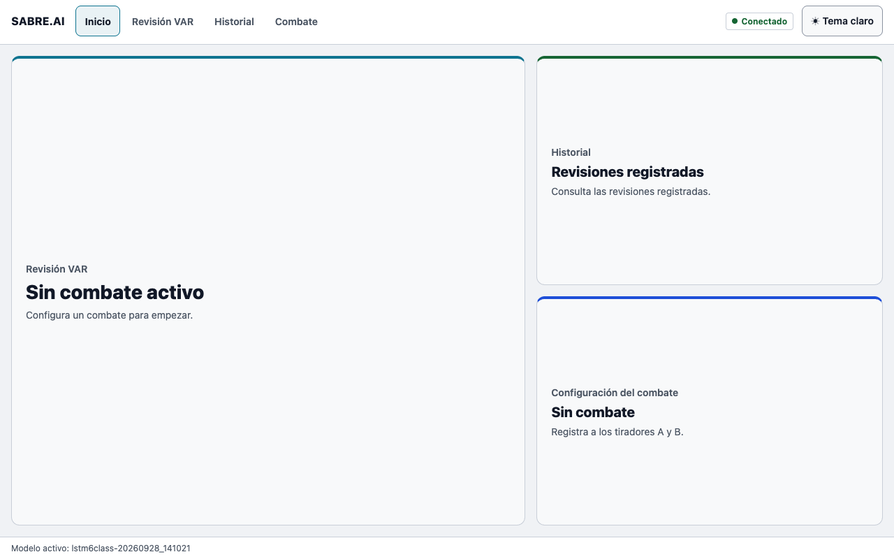

El encabezado contiene los botones "Inicio", "Revisión VAR", "Historial" y "Combate", el indicador de estado y el botón de tema ("Tema claro" o "Tema oscuro"). Con un combate activo agrega "Pista", "Árbitro:" y el botón "Finalizar combate".

### Indicador de estado

El indicador consulta el estado del sistema cada 10 segundos (`GET /health`).

| Texto | Significado | Qué hacer |
|---|---|---|
| "Verificando" | Aún no hay respuesta. | Espere unos segundos. |
| "Conectado" | El servicio Fog, Redis y PostgreSQL responden. | Continúe. |
| "Degradado" | Al menos uno de los tres componentes falla. | No inicie una sesión. Avise a quien instala el sistema (`GUIA_INSTALACION.md`, sección 12). |
| "Sin conexión" | El servicio Fog no responde. | Compruebe que Fog esté en marcha y avise a quien instala el sistema. |

## 4. Flujo de una sesión

El flujo tiene siete pasos: configurar el combate, cargar el clip, analizar, revisar la sugerencia, registrar la decisión, consultar el historial y finalizar el combate. Los pasos 1 a 5 se repiten por cada clip. Un combate admite cualquier número de clips y cada clip abre su propia revisión.

### 4.1 Configurar el combate (CU-01, F-039)

1. Seleccione "Combate" en el encabezado. El título de la pantalla es "Configurar combate".
2. En "Evento", seleccione la sesión de validación. Cada opción muestra el nombre y la fecha.
3. En "Pista", escriba la pista (por ejemplo, P1).
4. En "Árbitro", seleccione el árbitro del combate.
5. En la tarjeta "Tirador A · ROJ", escriba el alias en "Alias". Use siempre alias, nunca nombres de atletas.
6. En "Brazo armado", seleccione "Diestro" o "Zurdo". Es obligatorio y no tiene valor por defecto: las características del movimiento se calculan sobre ese brazo.
7. En "Menor de edad", seleccione "No" o "Sí".
8. En "Consentimiento firmado", seleccione "No" o "Sí". Con "Sí" aparece "Fecha del consentimiento (AAAA-MM-DD)". Si además el tirador es menor de edad, aparece "Firmante (apoderado)". Complete los campos que aparezcan.
9. Repita los pasos 5 a 8 en la tarjeta "Tirador B · VER".
10. Pulse "Crear combate" (atajo Ctrl+Intro). Resultado esperado: aparece la tarjeta "Combate activo" con la pista, el árbitro y los alias, y el encabezado muestra "Pista" y "Árbitro:".

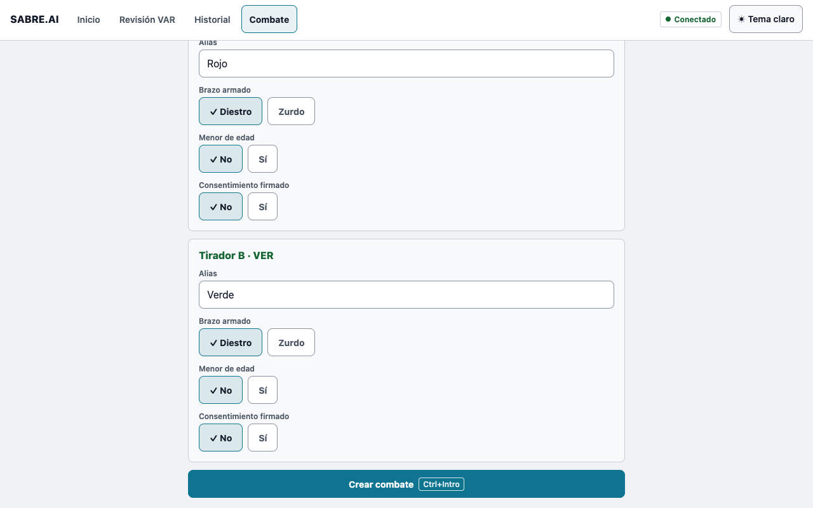

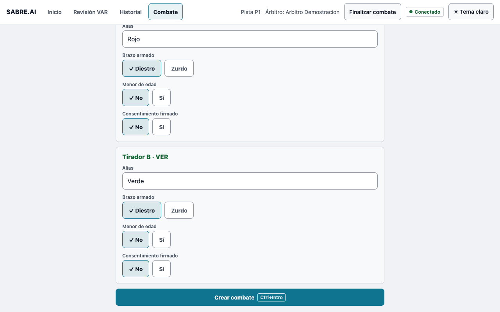

A es el tirador ROJ (izquierda en cámara) y B es el tirador VER (derecha en cámara). Esta asignación es fija.

El combate activo se conserva si recarga la página. Si el combate ya no existe en el sistema, se descarta.

Si falta un dato, la pantalla no crea el combate y muestra un mensaje con la indicación "Corrige el dato y vuelve a pulsar Crear combate."

| Mensaje | Causa |
|---|---|
| "Falta seleccionar el evento" | No eligió un evento. |
| "Falta la pista" | El campo "Pista" está vacío. |
| "Falta seleccionar el árbitro" | No eligió un árbitro. |
| "Falta el alias del tirador A" (o B) | El alias está vacío. |
| "Falta el brazo armado del tirador A" (o B) | No eligió "Diestro" o "Zurdo". |
| "Indica si el tirador A es menor de edad" (o B) | No eligió "No" o "Sí". |
| "Falta la fecha del consentimiento del tirador A" (o B) | Consentimiento firmado sin fecha. |
| "Falta el firmante del tirador A (menor de edad)" (o B) | Menor con consentimiento firmado sin firmante. |

Si la lista de eventos o de árbitros no carga, la pantalla muestra "No se pudo cargar el catálogo" con el botón "Reintentar", o bien "No hay eventos registrados", "No hay árbitros registrados" o "No hay eventos ni árbitros registrados" con el botón "Recargar". En ambos casos no se puede crear el combate hasta que el catálogo cargue.

### 4.2 Cargar el clip y simular el tocado (CU-02, CU-03)

1. Seleccione "Revisión VAR" en el encabezado. Si no hay combate activo, la pantalla muestra "No hay combate activo" y el botón "Configurar combate".
2. En "Paso 1 · Clip", pulse "Elegir archivo" (atajo S) y seleccione un archivo MP4 o MOV. Resultado esperado: el nombre del archivo aparece junto al botón y el clip se muestra en el reproductor.
3. En "Luz Favero simulada (al menos una)", pulse "A · ROJ", "B · VER" o ambos, según las luces que se encendieron. Un botón activo muestra un círculo relleno y el texto a su derecha indica "Luz A", "Luz B" o "Ambas luces". Las luces se conservan al cambiar de clip: verifíquelas en cada clip.
4. Con el reproductor, lleve el clip al instante del tocado. Puede usar "Reproducir" o "Pausa", "◀ Cuadro" (atajo coma), "Cuadro ▶" (atajo punto) y las velocidades "1×", "0.5×" y "0.25×".
5. Pulse "Marcar tocado aquí". Resultado esperado: junto al botón aparece el instante en milisegundos, por ejemplo "433 ms". Antes de marcar se lee "Sin marcar".

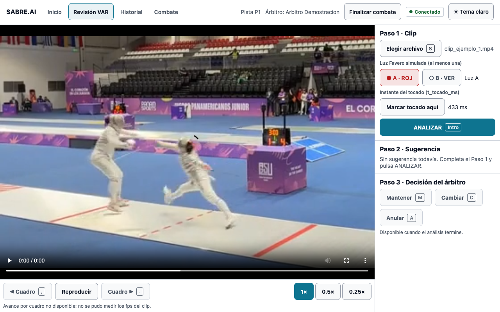

Al elegir otro archivo, el instante del tocado vuelve a "Sin marcar" y se descarta el resultado anterior.

El botón "ANALIZAR" permanece desactivado hasta completar los requisitos. Debajo aparece "Falta: un combate activo.", "Falta: elegir un clip.", "Falta: marcar la luz A o la luz B." o "Falta: marcar el instante del tocado."

### 4.3 Solicitar la revisión y esperar la sugerencia (CU-05)

1. Pulse "ANALIZAR" (atajo Intro). En esta versión, pulsar "ANALIZAR" abre la revisión del clip. El sistema no registra qué tirador la solicitó.
2. Espere. El botón cambia a "Analizando…" y aparece "Analizando… N s de 60 s". La latencia objetivo de la sugerencia es de 60 segundos como máximo.
3. Resultado esperado: aparece "Listo" y el "Paso 2 · Sugerencia" muestra el resultado.

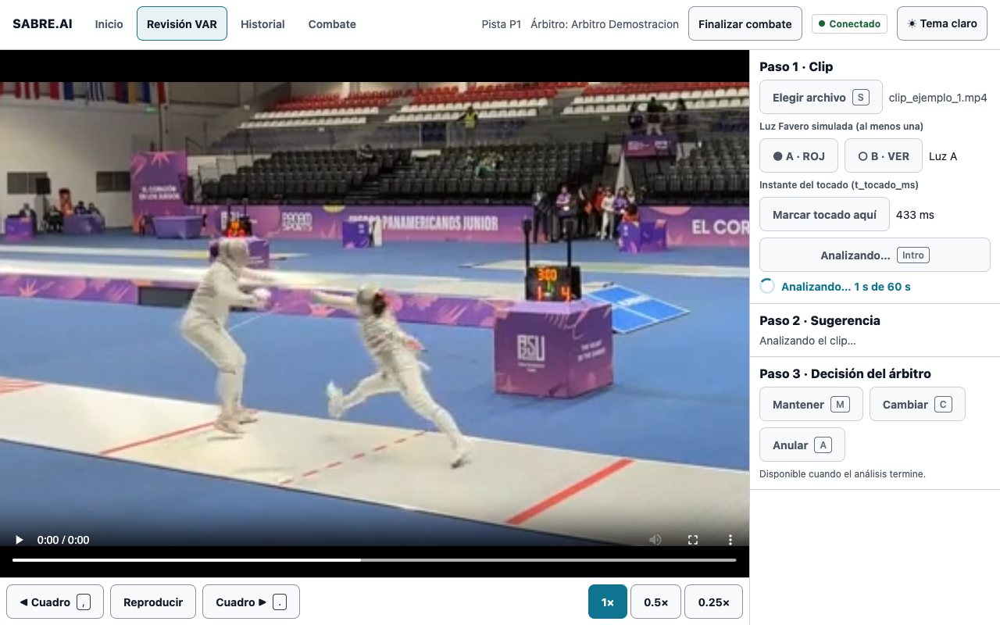

Si pasan 60 segundos sin respuesta, la pantalla muestra "Clasificación no disponible" con el motivo `timeout` (sección 5) y usted sigue el procedimiento VAR habitual.

Si el sistema rechaza el clip o no hay conexión, aparece "Error: no se pudo analizar el clip", el detalle y el botón "Reintentar". En ese caso no se abre revisión.

### 4.4 Revisar la sugerencia

El "Paso 2 · Sugerencia" muestra, bajo el rótulo "Sugerencia del sistema":

- La acción: "Ataque", "Contraataque" o "Riposte".
- El tirador atribuido: "A · ROJ" o "B · VER".
- La "Confianza" en porcentaje, con una barra.

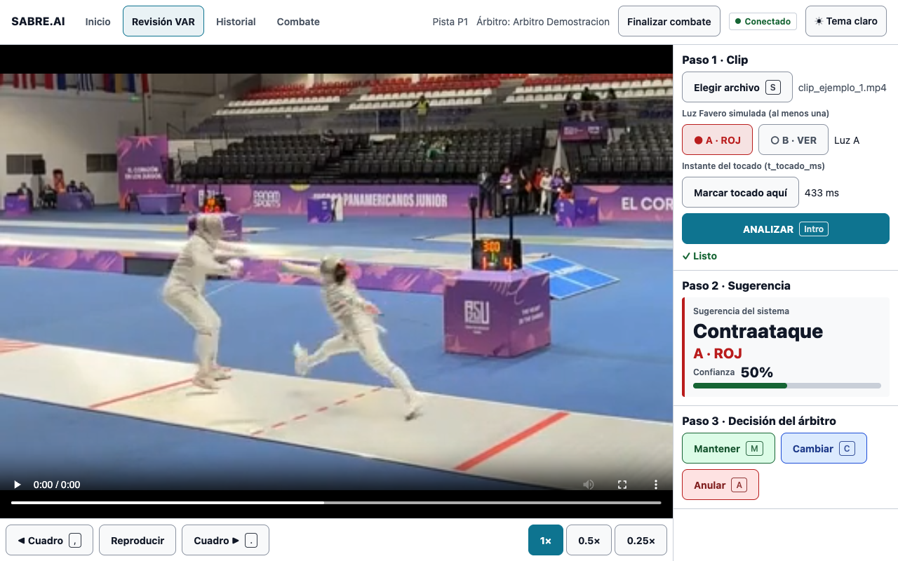

Si el sistema no puede clasificar, el paso muestra "Clasificación no disponible", el motivo y la indicación "Continúe con el procedimiento VAR habitual." Los motivos están en la sección 5.

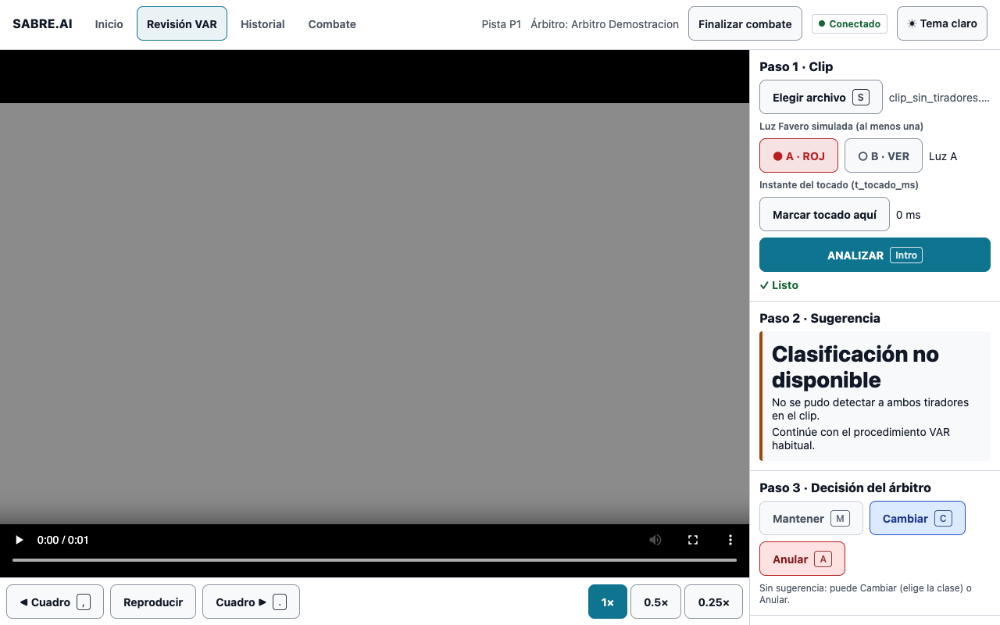

Esta versión no muestra la superposición biomecánica sobre el video (CU-08) ni la justificación de la clasificación con los eventos clave (CU-09). Ambas están en el Anexo B.

### 4.5 Registrar la decisión (CU-10, F-033)

El "Paso 3 · Decisión del árbitro" tiene tres botones. Se activan cuando el análisis terminó y hay una revisión abierta.

| Botón | Atajo | Qué registra |
|---|---|---|
| "Mantener" | M | La clase sugerida como clase final. Está activo solo si hay sugerencia. |
| "Cambiar" | C | La clase final que usted elija. Puede usarse sin sugerencia. |
| "Anular" | A | La anulación de la acción, sin clase final (acción simultánea, FIE t.106). |

Procedimiento:

1. Revise el video y la sugerencia.
2. Pulse "Mantener", "Cambiar" o "Anular".
3. Si pulsó "Cambiar", aparece "Elige la clase final" con las 6 clases. La clase sugerida lleva la marca "(sugerida)" y no está preseleccionada. Pulse la clase final. Para volver sin decidir, pulse "Cancelar" (atajo Esc).
4. Resultado esperado: aparece "Veredicto registrado" con "Mantiene", "Cambia" o "Anula" y, si corresponde, la clase final.

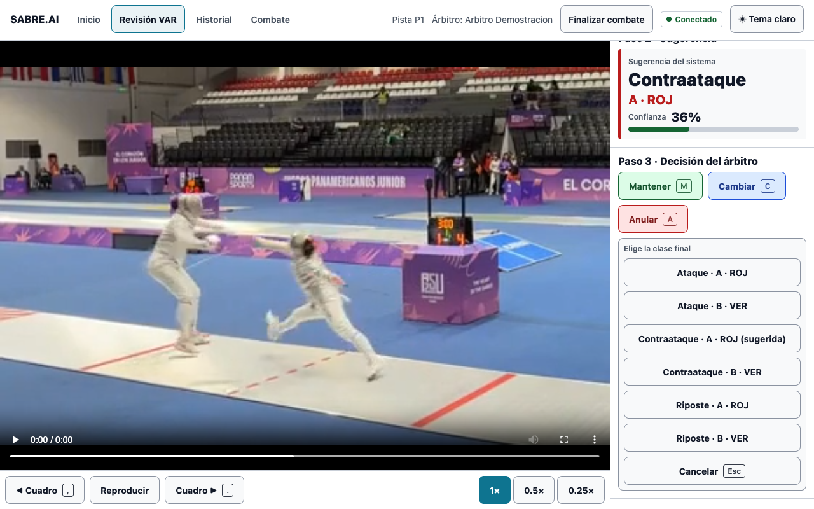

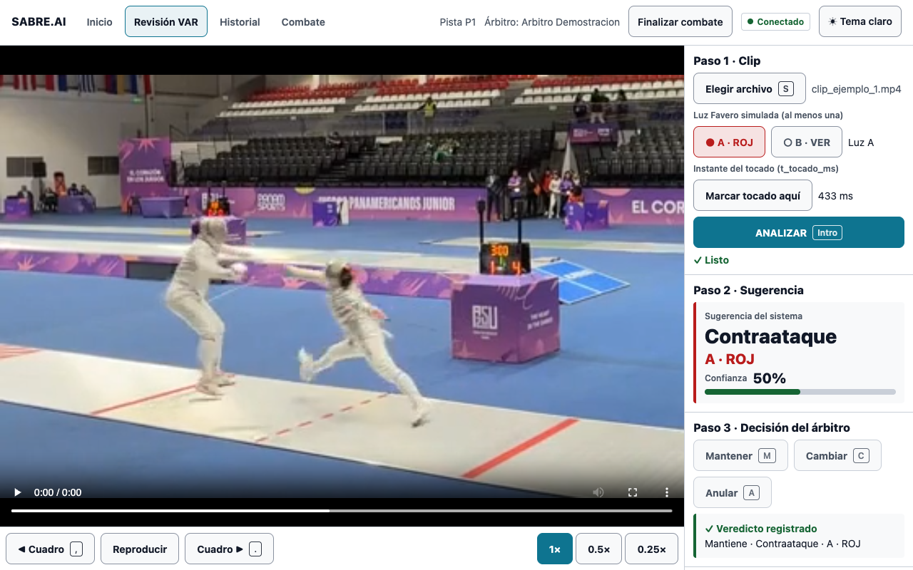

Una vez registrada, la decisión no se puede editar: los botones quedan desactivados y el sistema rechaza un segundo veredicto sobre la misma revisión (error 409). Los registros son de solo adición.

Si el registro falla, aparece "No se pudo registrar el veredicto" con la indicación "Vuelve a elegir tu decisión." Si no hay revisión abierta, el paso indica "No hay revisión abierta: continúe con el procedimiento VAR habitual." Antes de terminar el análisis indica "Disponible cuando el análisis termine." Sin sugerencia y con revisión abierta indica "Sin sugerencia: puede Cambiar (elige la clase) o Anular."

### 4.6 Finalizar el combate

1. Pulse "Finalizar combate" en el encabezado.
2. Resultado esperado: la interfaz abre "Combate", sin combate activo. Las revisiones registradas se conservan.

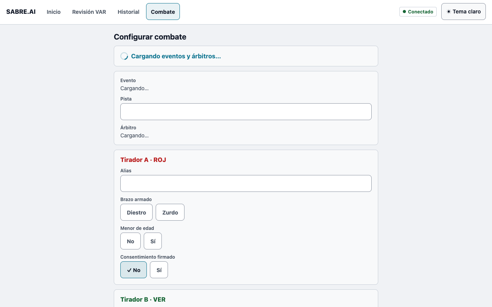

Sin combate activo, "Revisión VAR" muestra "No hay combate activo" y "Historial" muestra "No hay un evento activo". Para continuar, cree un combate nuevo (sección 4.1).

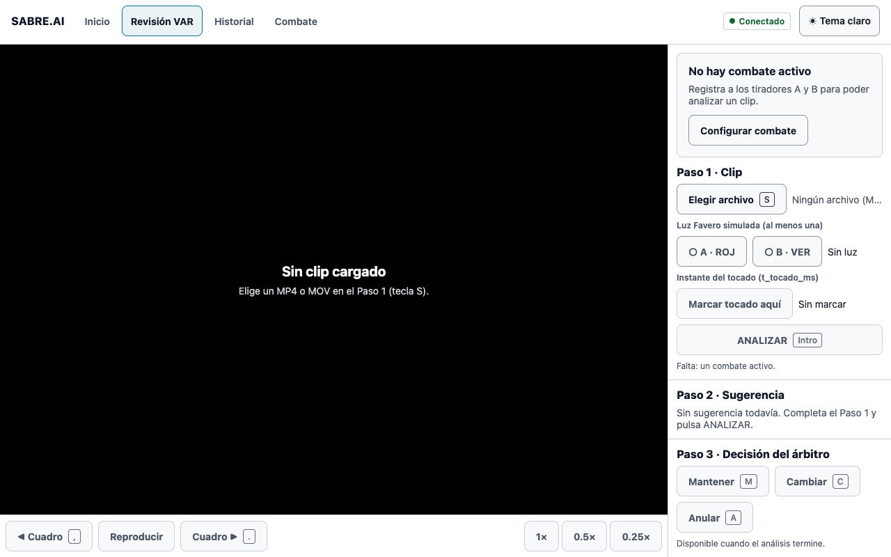

### 4.7 Historial (CU-12)

1. Seleccione "Historial" en el encabezado. Con combate activo, el título es "Revisiones del evento" seguido del número de revisiones.
2. Lea la lista, de la revisión más reciente a la más antigua. Muestra solo las revisiones del evento del combate activo.

| Columna | Contenido |
|---|---|
| Fecha y hora | Momento en que se abrió la revisión. |
| "Sugerencia" | Acción y tirador (por ejemplo, "RIPOSTE · B") o "No disponible". |
| "Confianza" | Porcentaje de la sugerencia. Vacío si no hubo sugerencia. |
| "Veredicto del árbitro" | "Mantiene", "Cambia" o "Anula", con la clase final si existe, o "Pendiente". |
| "Concordancia" | "Coincide" si la clase sugerida es igual a la clase final, "Difiere" si no. Vacío si la sugerencia no estuvo disponible, si no hay veredicto o si se anuló. |

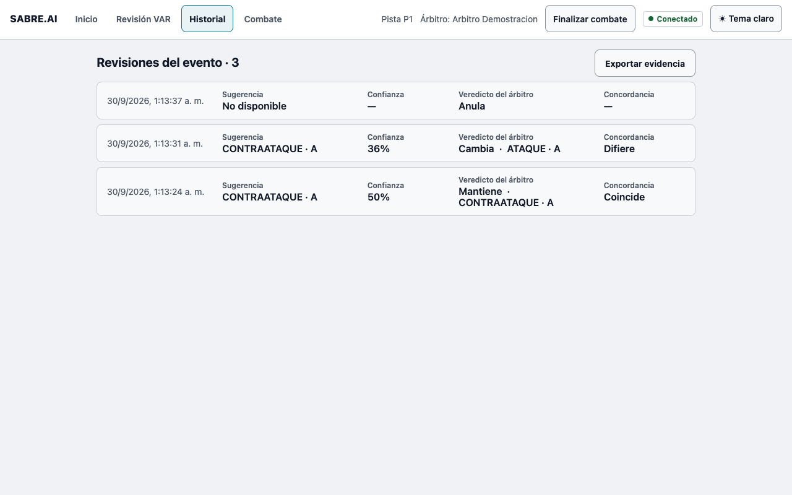

3. Pulse una fila para abrir el detalle. Pulse otra vez para cerrarlo. El detalle muestra:
   - "Sugerencia del sistema": la clase, el tirador y la confianza; o "Clasificación no disponible" con el motivo; o "Aún sin clasificación".
   - Las probabilidades de las 6 clases, cuando existen.
   - "Decisión del árbitro" y la fecha de registro ("Registrada:").
   - "Auditoría": "Registro n.º" y el código de integridad (hash) del registro.

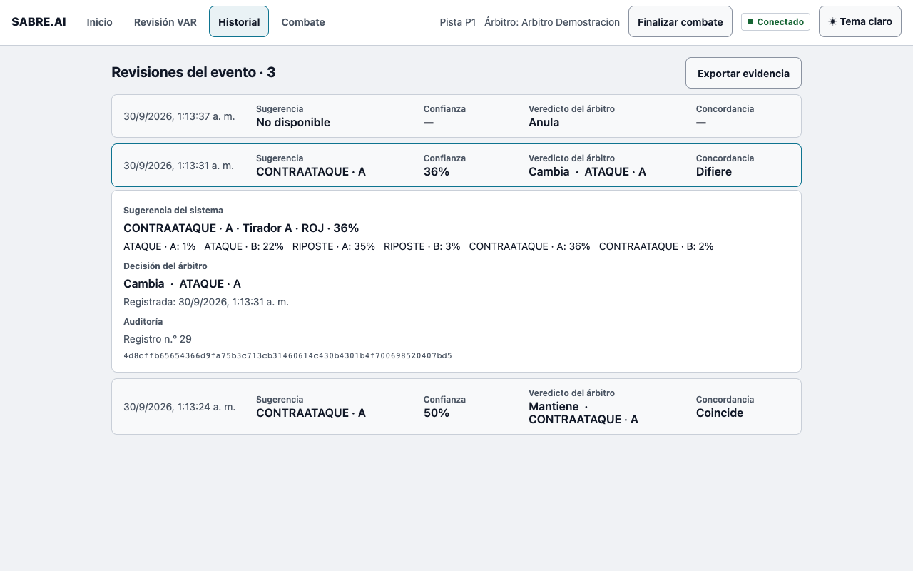

Si la carga falla, la pantalla muestra "No se pudo cargar el historial" o "No se pudo cargar el detalle de la revisión", con el botón "Reintentar". Sin revisiones muestra "Sin revisiones registradas" y el botón "Ir a Revisión VAR".

### 4.8 Exportar la evidencia

1. En "Historial", pulse "Exportar evidencia".
2. Resultado esperado: el navegador descarga el archivo `resumen-<evento_id>.json` y aparece "Evidencia exportada:" seguido del nombre del archivo.

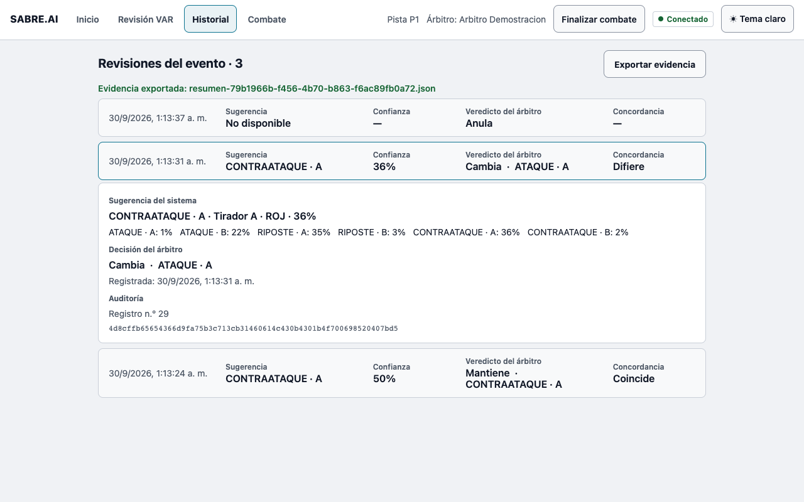

Si falla, aparece "No se pudo exportar la evidencia" y el botón "Reintentar".

El archivo contiene el resumen de la sesión de validación, con el bloque `V1` (tocado simulado) y el bloque `V2` (señal Favero) por separado y sin total. Solo cuentan las revisiones con veredicto.

| Campo | Cómo interpretarlo |
|---|---|
| `n_revisiones` | Número de revisiones con veredicto en el bloque. |
| `no_disponibles.por_motivo` | Cuántas revisiones no tuvieron sugerencia, por cada motivo de la sección 5. |
| `latencia` | Tiempo desde que se envía el clip hasta que hay sugerencia. Umbral: p95 de 60 000 ms como máximo. Una revisión no disponible cuenta como más de 60 s. |
| `latencia.p95_ms` vacío con `p95_excede_umbral` verdadero | El percentil 95 supera los 60 s: equivale a "> 60 s". |
| `latencia_inferencia` | Tiempo del clasificador por clip. Umbral: p95 de 50 ms como máximo. |
| `kappa.kappa` y `kappa.banda` | κ de Cohen entre la sugerencia y la clase final del árbitro, con su banda. `cumple` es verdadero si κ es 0.61 o más. |
| `kappa.calculable` falso | κ no se puede calcular (el archivo `resumen.md` lo escribe como "no calculable"). `kappa`, `banda` y `cumple` quedan vacíos y `motivo` explica la causa. |
| `concordancia` | Porcentaje de revisiones donde la sugerencia coincide con la clase final. |
| `matriz_confusion` | Tabla de 6 por 6: filas, clase sugerida; columnas, clase final del árbitro. |
| `integridad` | Resultado de la verificación de la cadena de auditoría. |

κ y la concordancia usan las revisiones con sugerencia disponible y no anuladas (campo `n` de cada bloque). κ no es calculable con menos de 2 revisiones de ese tipo, ni cuando hay una sola clase en ambos lados.

Bandas de κ (Landis y Koch): menor que 0, pobre; 0 a 0.20, leve; 0.21 a 0.40, aceptable; 0.41 a 0.60, moderada; 0.61 a 0.80, sustancial; 0.81 a 1.00, casi perfecta.

Los archivos `revisiones.csv` y `resumen.md` de la evidencia los genera quien instala el sistema con un script (`GUIA_INSTALACION.md`, sección 10).

### 4.9 Inicio

"Inicio" muestra tres bloques y, cuando corresponde, un resumen y el modelo activo.

| Elemento | Contenido |
|---|---|
| "Revisión VAR" | "Pista" y el número de pista, y los alias de A y B, con el combate activo. Sin combate: "Sin combate activo" y "Configura un combate para empezar." Abre "Revisión VAR". |
| "Historial" | "Revisiones registradas". Abre "Historial". |
| "Configuración del combate" | "Combate activo" o "Sin combate". Abre "Combate". |
| "Resumen de la sesión" | Una línea por validación con revisiones, por ejemplo "Validación 1 · 3 revisiones · κ 0.33 (aceptable) · latencia p95 48 ms". Solo aparece si el evento del combate activo tiene revisiones con veredicto. Si κ no es calculable, la línea omite κ. Si el p95 supera los 60 s, la línea indica "latencia p95 > 60 s". Una revisión sin sugerencia cuenta como más de 60 s: basta con que más del 5 % de las revisiones no tenga sugerencia para que aparezca "latencia p95 > 60 s". |
| "Modelo activo:" | Nombre de la versión del modelo en uso. |

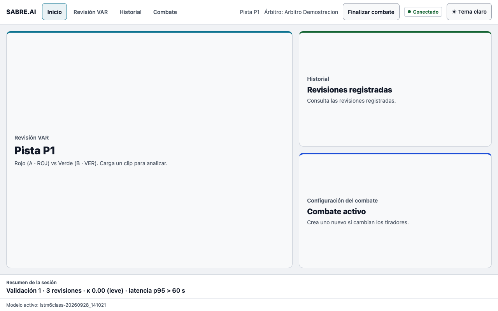

Los datos del resumen y del modelo se leen del sistema. Si no existen o la consulta falla, no se muestran.

### 4.10 Atajos de teclado

| Atajo | Acción |
|---|---|
| S | Elegir archivo. |
| Intro | ANALIZAR, cuando están completos los requisitos. |
| M, C, A | Mantener, Cambiar, Anular. |
| Esc | Cancelar la selección de la clase final. |
| Coma y punto | Cuadro anterior y cuadro siguiente. |
| Ctrl+Intro | Crear combate. |

Los atajos sin Ctrl no actúan mientras escribe en un campo de texto.

## 5. Estados y mensajes

### Motivos de "Clasificación no disponible"

| Motivo | Texto en pantalla | Qué significa | Qué hacer |
|---|---|---|---|
| `pose_incompleta` | "No se pudo detectar a ambos tiradores en el clip." | El sistema no detectó a los dos tiradores, o el clip tiene menos de 3 fotogramas. | Siga el procedimiento VAR habitual. Verifique que el clip muestre a ambos tiradores y vuelva a cargarlo. Puede registrar "Cambiar" o "Anular". |
| `confianza_baja` | "La confianza de la sugerencia quedó por debajo del umbral configurado." | La confianza no alcanzó el umbral. En esta versión el sistema no produce este motivo, porque el umbral no está definido. | Siga el procedimiento VAR habitual. |
| `clase_fuera_mvp` | "La acción detectada queda fuera de las 6 clases del sistema." | La acción no corresponde a una de las 6 clases. En esta versión el sistema no produce este motivo. | Siga el procedimiento VAR habitual. |
| `timeout` | "El análisis superó el límite de 60 s." | El sistema no respondió a tiempo. | Siga el procedimiento VAR habitual. Puede volver a cargar el clip. Si se repite, avise a quien instala el sistema. |
| `sin_senal_favero` | "No llegó la señal de la luz Favero." | Corresponde a la Validación 2. En la Validación 1 las luces se marcan a mano y el sistema no genera este motivo. | Siga el procedimiento VAR habitual. |
| `mensaje_invalido` | "El análisis recibió datos inválidos." | Un componente interno rechazó los datos del clip. | Vuelva a cargar el clip. Si persiste, avise a quien instala el sistema. |
| Otro valor | "El sistema no pudo clasificar la acción." | Motivo no reconocido. | Siga el procedimiento VAR habitual y avise a quien instala el sistema. |

En todos los casos la pantalla agrega "Continúe con el procedimiento VAR habitual." y usted puede registrar "Cambiar" o "Anular".

### Errores de la interfaz

Los errores del sistema se muestran con el formato "Fog CÓDIGO: detalle". El detalle lo redacta el sistema.

| Mensaje | Dónde | Causa y acción |
|---|---|---|
| "Error: no se pudo analizar el clip" | Revisión VAR | El sistema rechazó el clip o no hay conexión. Lea el detalle: 400, el archivo no abre como video o tiene menos de 3 fotogramas; 413, el archivo supera el tamaño máximo (200 MB por defecto); 422, falta la luz o el instante del tocado está fuera de la duración del clip; 404, el combate no existe; 503, no hay una versión de modelo activa. Corrija y pulse "Reintentar". |
| "No se pudo verificar el combate activo" | Revisión VAR | No se pudo comprobar el combate recordado. Pulse "Reintentar". |
| "No se pudo registrar el veredicto" | Revisión VAR | El registro falló. Un código 409 indica que la revisión ya tiene veredicto o aún no tiene clasificación registrada. Vuelva a elegir la decisión. |
| "No se pudo cargar el catálogo" | Combate | No se leyeron eventos y árbitros. Pulse "Reintentar". |
| "No se pudo cargar el historial" | Historial | Falló la lista. Pulse "Reintentar". |
| "No se pudo cargar el detalle de la revisión" | Historial | Falló el detalle. Pulse "Reintentar". |
| "No se pudo exportar la evidencia" | Historial | Falló la descarga. Pulse "Reintentar". |
| "Sin conexión" | Encabezado | El servicio Fog no responde (sección 3). |

## 6. Clases tácticas

El modelo distingue 3 acciones para cada tirador, lo que da 6 clases. En "Historial" las acciones se escriben en mayúsculas.

| Clase en la interfaz | Tirador | Definición |
|---|---|---|
| Ataque · A · ROJ | A | Ataque del tirador A. |
| Ataque · B · VER | B | Ataque del tirador B. |
| Contraataque · A · ROJ | A | Contraataque del tirador A, simultáneo al ataque del rival. |
| Contraataque · B · VER | B | Contraataque del tirador B, simultáneo al ataque del rival. |
| Riposte · A · ROJ | A | Respuesta del tirador A después de parar el ataque del rival. |
| Riposte · B · VER | B | Respuesta del tirador B después de parar el ataque del rival. |

Estas definiciones describen la anotación del conjunto de datos con el que se entrenó el modelo. El texto de las reglas FIE t.101 a t.105 no forma parte de esta documentación: consulte el reglamento vigente. La opción "Anular" cubre la acción simultánea: se anulan ambos golpes y se repone en guardia (FIE t.106).

## 7. Limitaciones visibles para el usuario

- La sugerencia es orientativa. La decisión es siempre del árbitro.
- Rendimiento del modelo: F1 macro de la serie de 10 corridas de 0.4856 ± 0.0322 (N = 10), frente a 0.167 de un clasificador al azar entre 6 clases. El umbral de aceptación es 0.65 y no se alcanza en esta versión. Cuente con sugerencias equivocadas.
- No hay autenticación: cualquier persona con acceso a la dirección puede configurar combates, decidir y exportar la evidencia.
- La luz Favero y el instante del tocado los marca usted. Una luz o un instante mal marcados cambian la sugerencia.
- La interfaz reproduce un solo clip por revisión, sin sincronía de dos cámaras.
- Clases y reglas corresponden solo a sable.
- La descarga del resumen y la reproducción de video solo están disponibles en la versión web.

## Anexo A. Trazabilidad

| Sección | CU | HU |
|---|---|---|
| 4.1 Configurar el combate | CU-01 | F-039 |
| 4.2 Cargar el clip y simular el tocado | CU-02, CU-03 | F-037, F-038 |
| 4.3 Solicitar la revisión | CU-05, CU-06 | F-030 |
| 4.4 Revisar la sugerencia | CU-07 | F-030, F-027 |
| 4.5 Registrar la decisión | CU-10, CU-11 | F-033, F-034 |
| 4.6 Finalizar el combate | CU-01 | F-039 |
| 4.7 Historial | CU-12 | F-034 |
| 4.8 Exportar la evidencia | CU-12 | F-034 |
| 4.9 Inicio | CU-12 | F-034 |
| 5 Estados y mensajes | CU-06 | F-030 |
| 6 Clases tácticas | CU-06 | F-005 |

## Anexo B. Funciones fuera de esta versión

- CU-04 Capturar acción en tiempo real con dos cámaras y buffer circular (F-001, F-014, F-015, F-017): Validación 2.
- Lectura del aparato Favero por RJ11 y sincronización con el fotograma (F-002, F-004, F-016): Validación 2.
- CU-05, flujo alterno: rechazo de la solicitud de revisión por el árbitro; la interfaz no tiene botón de rechazo.
- Recorte automático de los 5 s previos al tocado (RF-01): el instante marcado se guarda pero no recorta el clip.
- Revisión del clip de ambas cámaras con ±3 s alrededor del toque y cuadros sincronizados (F-006, F-007): la interfaz reproduce un solo clip.
- CU-08 Superposición biomecánica de esqueleto, arma y trayectoria (F-031).
- CU-09 Justificación de la clasificación, eventos clave y criterio FIE (F-035, F-008) y mensaje "Evidencia insuficiente".
- CU-12, filtros por combate, fecha y árbitro, y verificación del hash con marca de registro alterado: la pantalla muestra el hash pero no lo verifica.
- CU-13 Gestión de versiones del modelo desde la interfaz: se hace con `scripts/registrar_modelo.py`.
- CU-14 Reentrenamiento del modelo desde la interfaz.
- CU-15 Calibración de cámaras (F-010).
- CU-16 Alertas de baja calidad de video o desincronización (F-011).
- Autenticación por rol (RF-26).
- Reportes por sesión en PDF o CSV desde la interfaz (F-009): el CSV de la sesión se genera con `scripts/exportar_evidencia.py`.
- Captura de la decisión con la pregunta "¿Cambia la decisión original en pista?" y clase final obligatoria también con "Mantener" (documentada en `docs_claude/contexto_sabre.md`, sección 8): la interfaz actual registra "Mantener" con la clase sugerida.
